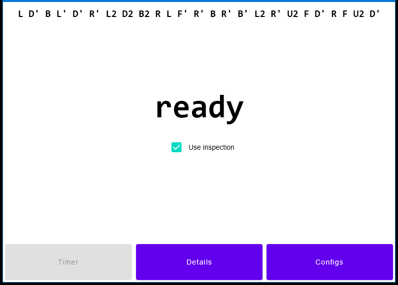
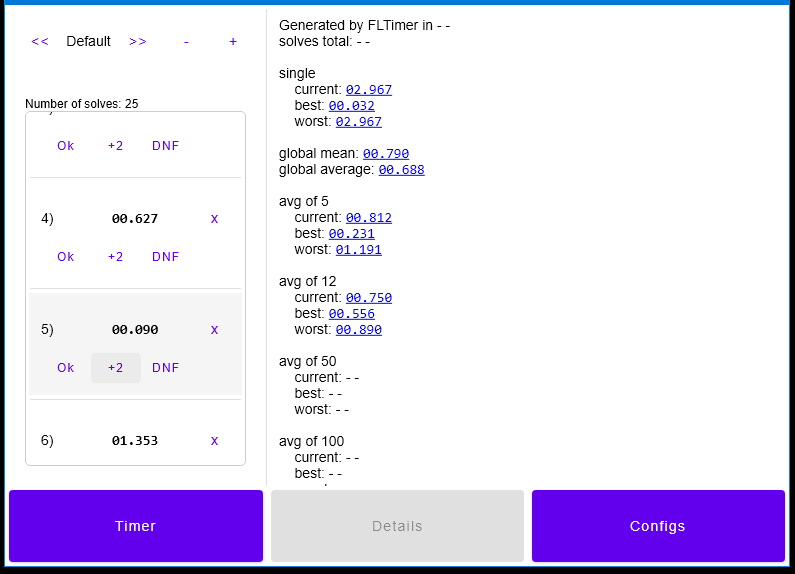

# My Puzzle Timer

This is my final repository to hold my _speedcubing_ timer project. For some years I have been practicing programming in some contexts, and now I decided to use all of this knowledge to build this application.

Doing this, I hope to mix concepts of the most various programming topics, going from architecture decisions to graphic rendering or even design stuff and/or networking.

Also, my aim in creating this is not to release something to compete with other applications of the same type but, instead, to put my knowledge in check and see if I can really write the application from beginning to end.

# Application overview

This is an application used to practice the speedcubing modality. This offers a chronometer with other integrated tools, such as scramble generators, statistics measurement and so on. Also, we may have other extra tools implemented over the application development, when/if needed.

Also, you may notice that inside some packages was places some other `README.md` presentation files. They should work to document or even to tell some implementation details/insights/guides.

# Project structure

The project is being built over sub gradle projects on the JVM/Kotlin enviromnent. They are:

- `Core`: holds "common" code used by any other module;
- `UI`: holds code related to the application UI. The UI here aims to be consistent between all platforms and, for this,
  makes use of the power of the Jetpack Compose;
- `Desktop`: module to hold code only useful to desktop version build;
- `Mobile`: module to hold code only useful to mobile (Android) version build;
- (TODO: `Web`);
- (TODO: `iOS`).

All of these subprojects are treated as "modules", and may have dependency between themselves.

Also, all these modules aim to be an individual gradle project, having its own build and dependencies, making it possible to manage individual and platform-specific code in a clean way.

Finally, `web` and `iOS` are targets that need a bit more attention, once they works in a little different way of the other modules.

# Features

This timer should offer the main features that I need for myself. However, it is known that this might be useful for different users, since they are very useful for their purpose. These features are:

- Timing solutions with good precision (is the nanosecond precision implementation worth it?);
- Great variety of scrambling tools;
- Good statistics measurement;
- Nice custom binary data management included.

There are other features in mind being planned to be implemented after the basic application is finished, such as:

- Specific training tools (blindfolded, _speffz_ helpers, a nice keyboard for
  sequence typing, and so on);
- Networking: 1 or more cubers will be able to connect each other in the timer and share their solutions and statistics
  in real time;
- Virtual 3D puzzles to play/time.

All of these features I plan to implement by myself as good as I can, using only my own knowledge. Reinventing the wheel today is not a good thing to do, but when it comes to studying it is one of the most powerful weapons. :)

# Some images
Following we have some images presenting aspects of the current application's UI. Note that this is a heavy rough version and will hardly be changed over the application development.

### Main timer screen view:
  
### Details (solves list/statistics) view:
  

# Tasks to finish

The following items are those which are being developed at this moment. Finishing then should lead the application to the first alpha version.

### Core
Most urgent `core` tasks needed:

- Implement "`wait_for_ready`" state in timer management to avoid instant starting solves after finish one;
- Clean up events listening;
- Implement all _WCA_ scrambles generators;
- Please, add tests!
    - Event notification API;
    - Statistics calculation.

### UI
Most urgent `UI` tasks needed:

- Make UI fire `TOGGLE_DOWN` event based on any key code to avoid restrict user to stop only using `spacebar`; 
- Check layout consistence of the root composables between mobile and desktop;
    - For now, only the minimal root pieces of UI are worth of consistence. Full screens layouts can differ between platforms;
- Try better styles in the solves list items composables;
- Stabilize custom application ~~fonts~~, ~~colors~~, spacing and sizing;
- Get feeback about layout usability:
    - What relevant items should be in the main screen;
    - Is spliting details screen with solves and statistics useful/good?
    - Should we place quick configuration modifiers in the statistics screen to fast toggle scramble and/or "worsts" in the details screen?

### Gradle
Important tasks related to the application build system:
- Check if gradle distribution builds files works fine on distinct devices.

# Contributing

To set up this on your machine should be pretty easy if you have Android Studio or IntelliJ IDEA IDEs, once the importing tools from then are exceptional. If you don't/can't use these IDEs, VSCode editor is still usable, but keep in mind that programming gradle/kotlin/jvm/android on it should be a real challenge. We should to include more command line steps to replicate this project in your machine soon.

Also, have any suggestion and/or improvements to this repository? Feel free to open issues!
English fixes are appreciated. :)

# Contact me

If you are interested in talk me about this project or even another programming stuff, for now, I can answer on my email _god-lucas@hotmail.com_ and/or, if you have an Instagram account, find me there using my address _@lucas.alfare_

# [License](https://github.com/LucasAlfare/FLTimer/blob/view_modeling/LICENSE)
